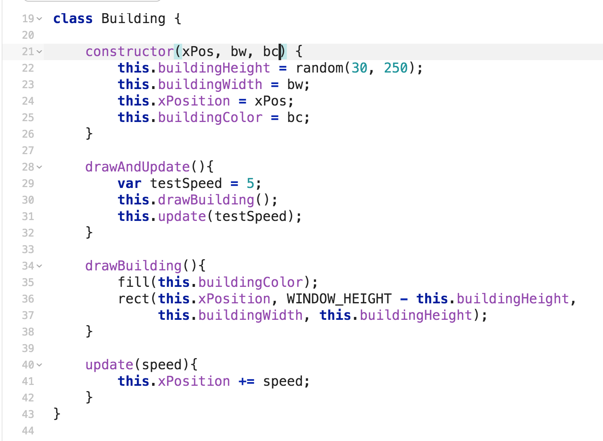
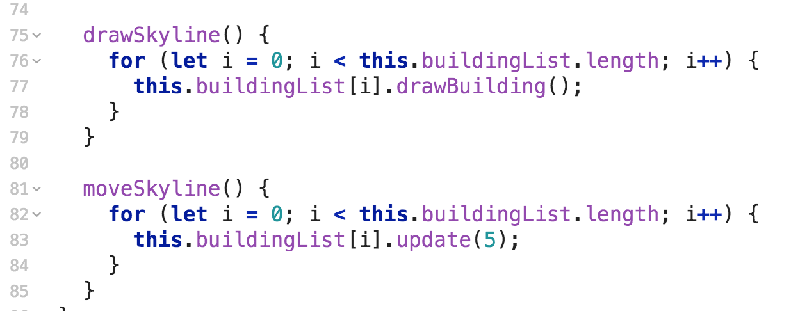

# City Scroller

Have you ever played a 2D video game and noticed how the background changes? Some of it moves slowly, like the clouds or mountains, and other parts move quickly, like the trees.

In this project you are going to write a program that simulates this behavior called City Scroller. By the end we're going to create a character to run through the city at the base of the canvas. When the character moves, the city should scroll. If the character is still the background shouldn’t be moving.

Let's get started

## Setup

### Glitch - Beginner
Let's first start by grabbing a template. Go to [here](https://glitch.com/~polarized-land) and click Remix your Own.

You'll be editing `city-scroller.js`

You'll notice two functions `setup` and `draw`. These are functions that will be automatically called when you run your program.

Setup gets called once at the beginning of your program. Draw gets called every millisecond (you can change this by setting `framerate` in setup).

## Warmup

You are given a template to start out with that should produce a blue square on a black background when you click `Show --> In a New Window`

First thing you should do is play around with the template. See if you can figure out what each line of code can do by adjusting the numbers.

## Part I - Building

We first need to construct a Building. Well we already have a rectangle, we just need to attach it to the "ground"(i.e. the bottom of the screen).

### Construct Rectangle
Let's first define a variable that will keep track of the bottom of the screen.

You'll notice we created what's called a global constant. This means that the rest of our code inside this file will have access to this variable but not other code will be able the change the value of the variable. This makes sense because it would be weird for the height of our window to change in the middle of our game.

We'll then use that variable to construct our rectangle. The API for a rectangle states that first two values define the x and y position of the top left corner of the rectangle, the third value represents the width, and the fourth value represents the height.

So in order to have our rectangle connected to the ground, we need to use our `WINDOW_HEIGHT` and the height of our rectangle to connect. Let's create a variable to store the height of our rectangle and then use that variable to create a rectangle that's always connected to the bottom of the screen.

Play around with the value of `rectHeight` tp see that it will always be connected to the bottom.

### Create Building class

We know our background is going to have all different types of Buildings of different sizes, colors, and positions on the screen. This probably means we should create a way to easily create different types of buildings.

Go ahead and create the Building class below:

There's a bunch of things going on in here. Let's break them down one at a time.

### Constructor

The whole point of a class is to create "objects" that have variables that describe the objects (attributes) and functions that manipulate those variables (methods).

For example we might have the class `Human` with the attributes age, height, and hair color. Then you might have some methods called `grow`, `changeHairColor`, and `getAge` to interact with the attributes.

So in our constructor we are going to have 4 attributes

- xPosition
- buildingWidth
- buildingHeight
- buildingColor

To describe our Building. Our constructor sets the initial values of our Building. The width, height, and color of the Building are set by the parameters to the constructor (which means that we can manually set those variables when creating a building). The height we are setting randomly.

You'll also notice the keyword `this`. We use this to refer to our attributes and methods in our class.

Then we have 3 pretty straightforward methods.

### drawBuilding

This method contains the code that actually puts our building on the screen

### update

This method moves our building across the screen by updating the xPosition of the building. It takes in a speed so that we can have different buildings go at different speeds.

### drawAndUpdate

This method just calls our two other methods. It helps manage our code when we start having a lot of buildings that we're moving around.

### Test your Building class

Alright let's create a test building so that you can see how this works.

**Challenge** Create a couple of test buildings with different parameters so that you can see how constructors and methods work.

## Part II - Skyline

Now that we've created a few buildings, it'd be nice to create different layers of building with some that move slower than others to give the impression we're moving through a city.

Let's start with a class and a constructor:

You'll see this class has two attributes, `buildingList` and `newBuildingXPosition`.

`buildingList` will keep track of all the Buildings that are in the Skyline and we'll use the `newBuildingXPosition` to keep track of where to add a new building in our Skyline.

## addBuilding

Now let's create a method that will add a building to our Skyline. Add the below method `addBuilding` to your Skyline class.

You'll see that we create a random building width, create a building, add it to our list, and then update where the next building will go.

## drawSkyline

We want to be able to see if our `addBuilding` method works so let's create a `drawSkyline` method that will draw all the buildings on our Skyline.

## testSkyline

Now let's see if we can can add a couple of buildings to our skyline and put them on screen. Let's go back to our `setup` and `draw` functions and test our Skyline class.

You should see something like this in your show window.

If you add more buildings to your `testSkyline`, you'll see the buildings are always right next to each other. If you want to change this to have buildings overlap or buildings more spaced out, tweak how the `newBuildingXPosition` is updated in your `addBuilding` method.

## fillSkyline

We want our Skyline to take up the width of the screen. But we don't want to have to manually add buildings to our Skyline. Sounds like the perfect time for a method.

Let's create a method called `fillSkyline` that will create buildings across the width of screen. Let's also call it our constructor so that each Skyline automatically has enough buildings to fill the screen.

You should see something like this in your show window

## moveSkyline

Now we want to move our Skyline across. Let's create a `moveSkyline` method to accomplish this.

Now let's call it in our `draw` function. We can also delete the addBuilding calls in our setup function since we're using `fillSkyline` now. Your setup and draw function should now look like this

I actually want the buildings to go the left (we'll see why later on) so I'm going to change the `update` method in the Building class to subtract from the building xPosition instead of add.

One final tweak. I want to be able to easily create Skylines that move at different speeds. This means it should be an attribute of the class. Let's update our Skyline class to use a speed attribute.

First, let's update our constructor.

Then let's update our `moveSkyline` method to utilize it

Finally, I need to update my testSkyline variable to take in the speed.

Check and make sure that your scene still works.

Now create a couple of different Skylines with different speeds.

**Challenge** Create an attribute for the Skyline class called `buildingColor` that will represent the color of the buildings in that particular Skyline. See if you can create Skylines of different colors.

## Part III - Keypressed

We want to be able to control when our buildings move. We are going to use a built in function to p5.js called `keyIsDown` that will check to see when we press a key.

Adjust your draw function like so:

Don't forget to update your global variables up so that glitch doesn't throw an error

You should now be able to control your buildings going off the screen

